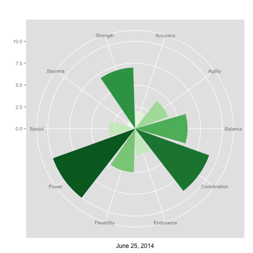
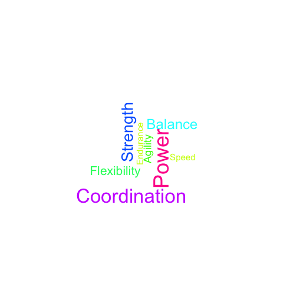

GPAT
========================================================
author: General Physical Attributes Test
date: Visualization App

<small> 
https://troutbum.shinyapps.io/gpat/
</small>

Visualization of 10 Fitness Attributes
========================================================
- Accuracy
- Agility
- Balance
- Coordination
- Endurance
- Flexibility
- Power
- Stamina
- Strength
- Speed

Plot Your Performance Test
========================================================

 

Wordcloud of your Performance Test
========================================================

 

GPAT App
========================================================
- Visualization tool for fitness assessment
- Plot your General Physical Attributes Test
- Plan your next training cycle

https://troutbum.shinyapps.io/gpat/
